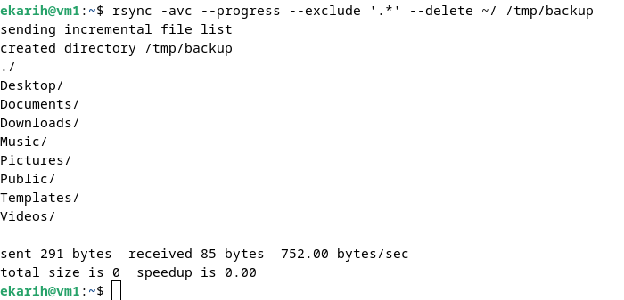
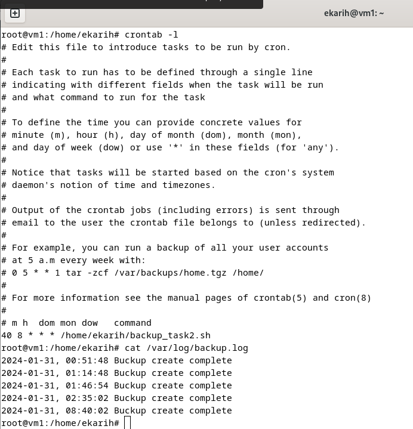
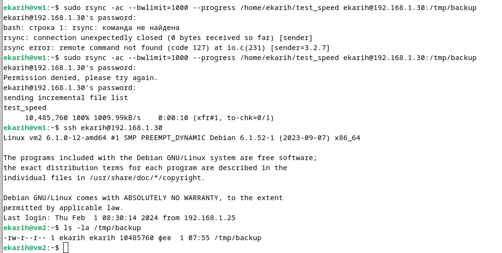

## Домашнее задание к занятию "Резервное копирование" - Карих Елена
---
### Задание 1

1. Составьте команду rsync, которая позволяет создавать зеркальную копию домашней директории пользователя в директорию /tmp/backup
2. Необходимо исключить из синхронизации все директории, начинающиеся с точки (скрытые)
3. Необходимо сделать так, чтобы rsync подсчитывал хэш-суммы для всех файлов, даже если их время модификации и размер идентичны в источнике и приемнике.
   На проверку направить скриншот с командой и результатом ее выполнения

### Решение 1
* Команда:
```
rsync -avc --progress --exclude '.*' --delete ~/ /tmp/backup
```


---
### Задание 2

1. Написать скрипт и настроить задачу на регулярное резервное копирование домашней директории пользователя с помощью rsync и cron.
2. Резервная копия должна быть полностью зеркальной
3. Резервная копия должна создаваться раз в день, в системном логе должна появляться запись об успешном или неуспешном выполнении операции
4. Резервная копия размещается локально, в директории /tmp/backup
   На проверку направить файл crontab и скриншот с результатом работы утилиты

### Решение 2
* Создала скрипт backup_task2.sh:
```
#!/bin/bash

backup_dir="/home/ekarih" # Эту директорию резервируем
done_dir="/tmp/backup"    # Резервируем сюда

rsync -ac --delete $backup_dir $done_dir 2>> /var/log/backup.log
if [ $? -eq 0 ]; then
    echo "$(date "+%F, %T") Buckup create complete" >> /var/log/backup.log
else
    echo "$(date "+%F, %T") Buckup ERROR" >> /var/log/backup.log
fi
```
ссылка на crontab [crontab](root)

---
### Задание 3

1. Настройте ограничение на используемую пропускную способность rsync до 1 Мбит/c
2. Проверьте настройку, синхронизируя большой файл между двумя серверами
   На проверку направьте команду и результат ее выполнения в виде скриншота

### Решение 3
* Сначала создала большой файл 10М - test_speed, командой:
```
fallocate -l 10M test_speed
```
* Настроила копирование:
```
rsync -ac --progress --bwlimit=1000 /home/ekarih/test_speed ekarih@192.168.1.30:/tmp/backup
```

---
